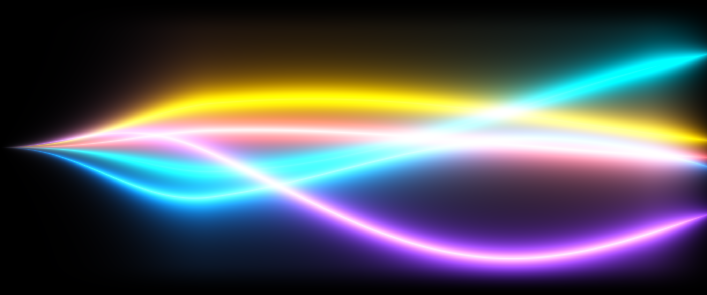
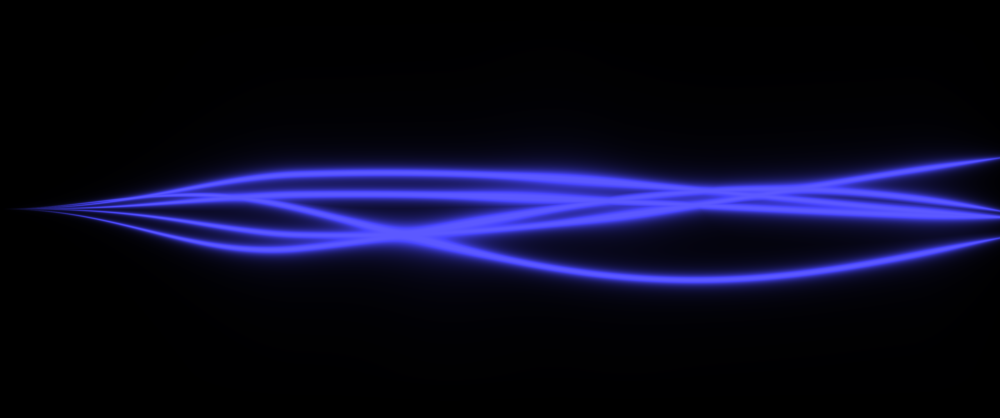
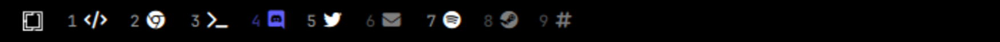
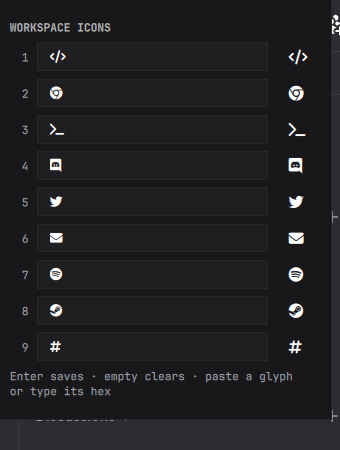

# Zavu

> One API. Every message.


A dark Omarchy theme derived from **Zavu Brand System V1.1**. Communication
infrastructure designed with scientific precision and editorial minimalism —
applied to a desktop.

Forked from [Last Horizon](https://github.com/HANCORE-linux/omarchy-lasthorizon-theme)
(MIT), fully recolored and re-geometried.

## What is Omarchy?

[Omarchy](https://omarchy.org) is an opinionated Arch Linux desktop built
around the [Hyprland](https://hypr.land) tiling compositor, by DHH
([basecamp/omarchy](https://github.com/basecamp/omarchy)). It ships a curated
set of tools — a Quickshell status bar, a launcher, notifications, a lock
screen, terminal, editor, browser — and wires them together so that a single
command restyles all of them at once.

That command is `omarchy theme set`, and a *theme* is what it reads. A theme
is a directory of small config files: one `colors.toml` that defines the
palette, plus per-application files for anything that needs more than colors.
Applying a theme copies that directory into place, generates the configs that
aren't shipped by hand, and reloads every running app. Nothing here is a
patch or an override — it is the whole look of the machine, versioned as text.

**You need Omarchy for this repository to be useful.** On any other Linux
setup the files are still readable as a color reference, but there is nothing
to apply them with.

## Install

```bash
omarchy theme install https://github.com/zavudev/omarchy-theme.git
omarchy theme set Zavu
```

## Palette

| Token | Hex | Name | Role |
|---|---|---|---|
| `background` | `#000000` | Void Black | System substrate |
| `foreground` | `#FFFFFF` | Pure White | Primary type |
| surface | `#18181B` | Surface | Popups, menus, cards |
| elevated | `#27272A` | Surface Elevated | Hairline borders, hover |
| `muted` | `#A1A1AA` | Muted Gray | Metadata, secondary text |
| `accent` | `#615FFF` | Signal Violet | Focus, selection, active state |

System colors (§5.3 — state only, never decoration):
`#4DF688` operational · `#FFDA5E` attention · `#FF5E5E` failure · `#6EFAFF` activity

## Design decisions

- **One accent, everywhere.** Violet appears on the focused window border, the
  selected row, and control focus. Nowhere else. The budget is ~3% of any
  composition (§5.5).
- **Editorial geometry.** Square corners, 1px borders, no shadows, no bloom.
  Technical-drawing precision, not a SaaS card.
- **Instrument motion.** A single curve — `cubic-bezier(0.22, 1, 0.36, 1)`,
  the brand's `ZAVU.motion.defaultEasing`. No overshoot, no spring physics;
  the brand system forbids both outright (§8.3, §12).
- **Six hues in the terminal.** The brand defines four system colors plus the
  accent, and syntax highlighting needs them separable. Orange (`#FF9C5E`) is
  a 50% mix of `warning` and `error` — the one derived value, and still inside
  the family. Nothing here is off-palette.

## Wallpapers

The first two are the **Strands** WebGL shader that runs in the hero of
`zavu.dev`. `tools/strands.c` is a literal CPU port of its fragment shader,
evaluated in the hero's resting state (no pulse, no fan, no pointer, no active
strand) with the uniforms the site passes it:
`count=5 · scale=1.5 · amplitude=1.05 · glow=2.6 · speed=0.18`.

| | |
|---|---|
|  |  |
| `01-strands.png` — the hero's channel palette (`#06B6D4 #EAB308 #FF4242 #1877F2 #7C3AED`). What the website shows. | `02-strands-signal.png` — same geometry, a single accent in the Signal Violet family. Keeps the one-accent rule (§5.5). |

|  |  |
| `05-strands-fan.png` — `uFanSpread` open. Five channels converge to a single point on the left and separate to the right. On the site this is a scroll state that lasts an instant. | `06-strands-pulse.png` — mid-click-pulse, where the whole bundle collapses to the accent. The most restrained frame the shader has: thin violet threads on void. |

Plus `03-void.png` — pure black. The void as substrate.

The last two are states the website only passes through. The renderer exposes
every uniform, so anything the shader can reach can be frozen:

```bash
tools/render 3440 1440 fan
tools/render 3440 1440 pulse
.strands-bin 3440 1440 --fan 0.3 --active 2 --focus 1 > custom.ppm
```

### Any resolution

The shader depends on aspect ratio, not just scale: `uv` is normalized by
height and the `env` envelope is measured across `uv.x`, so stretching a 16:9
render to 21:9 is not the same image as rendering it at 21:9. Render per
resolution instead of scaling:

```bash
tools/render 3440 1440                    # channel palette
tools/render 2560 1600 signal             # brand palette
tools/render 3840 2160 channels out.png
```

The repository ships 3440×1440. `tools/render` compiles the shader on first
use (needs `gcc` and ImageMagick) and takes about 100 ms per frame, so
generating a set for every display you own is cheap.

### Live wallpaper (optional)

`04-strands-live.png` is the same still image as `01-strands.png`, and on a
stock Omarchy that is all it is. Patch the background plugin, though, and the
name suffix turns it into the real shader, running live on the desktop:

```bash
omarchy plugin clone omarchy.background
# edits land in ~/.config/omarchy/plugins/<user>.background/Background.qml
```

Add to the root `Item` (and `import Quickshell.Services.UPower` at the top):

```qml
readonly property string liveShaderName: {
  var base = String(displayedBackground).split("/").pop()
  var m = base.match(/([A-Za-z0-9_]+)-live\.[A-Za-z0-9]+$/)
  return m ? m[1] : ""
}
readonly property url liveShaderUrl: liveShaderName === ""
  ? ""
  : Util.fileUrl(stateHome + "/omarchy/current/theme/tools/" + liveShaderName + ".frag.qsb")
readonly property bool liveShaderAllowed: !UPower.onBattery
```

And inside the `PanelWindow`, right after the `base` image:

```qml
ShaderEffect {
  id: liveShader
  anchors.fill: parent
  visible: root.liveShaderUrl != "" && root.liveShaderAllowed
  blending: false
  fragmentShader: root.liveShaderUrl
  property real uTime: 43.0
  property vector2d uResolution: Qt.vector2d(width, height)
}

FrameAnimation {
  running: liveShader.visible
  onTriggered: liveShader.uTime += frameTime
}
```

Then `omarchy restart shell` — a plugin hot-reload is not enough, the
layer-shell surface has to be rebuilt.

Three things make this cheap rather than a battery leak:

- **Occluded means free.** The wallpaper is a Wayland layer surface. Cover it
  with an opaque window and the compositor stops sending frame callbacks, so
  `FrameAnimation` stops and the shader stops drawing. Measured at 0.00% CPU
  with windows over it.
- **On battery it turns itself off.** `UPower.onBattery` hides the shader, and
  the still image underneath — the same pixels, rendered from the same shader —
  takes over. The desktop does not change appearance, it just stops moving.
  Back on AC it resumes on its own.
- **`uTime` starts at 43.** That is the exact frame the PNGs were rendered at,
  so the still and the live version are the same image at t=0. Switching
  between them, in either direction, has no visible seam.

Two live variants ship: `04-strands-live.png` (resting bundle) and
`07-strandsfan-live.png` (fan open). Both resolve to a `.qsb` of the same name.

The shader source is `tools/strands.frag` (Qt 6 dialect) and `tools/build-shaders`
compiles it once per variant, substituting the `FAN` constant. Run it after
editing the shader:

```bash
tools/build-shaders     # -> strands.frag.qsb (FAN=0), strandsfan.frag.qsb (FAN=0.20)
```

## Workspace icons (optional)

Also not part of the theme — a patched copy of Omarchy's workspace widget that
labels each workspace with an icon instead of leaving it a bare number, and
ships a panel to change them without editing QML.





```bash
omarchy plugin clone omarchy.workspaces
cp plugins/workspaces/*.qml ~/.config/omarchy/plugins/<user>.workspaces/
omarchy restart shell
```

`omarchy plugin clone` names the clone after your user, and both files are
written to work under any such name: the widget takes its id from whatever the
bar injects, so nothing here has to be renamed.

**Right-click any workspace** to open the panel; left-click still focuses the
workspace as before. There is an IPC entry point too, for a keybinding:

```lua
o.bind("SUPER + ALT + W", "Workspace icons", "omarchy-shell <user>.workspaces toggle")
```

Each row takes an icon in either of the two forms you are likely to have one
in — **pasted as a glyph**, or typed as a **codepoint** (`f121`, `U+F121`,
`0xF121`). Both are needed: a Nerd Font glyph cannot be typed and a codepoint
cannot be read, so the live preview on the right settles it before you save.
Enter saves, an empty field clears the icon back to a plain number.

Values are written to the widget's entry in `shell.json`, so they survive a
restart and stay editable by hand like the rest of the bar:

```json
{ "id": "<user>.workspaces", "icons": { "1": "\uf121", "2": "\uf268" } }
```

Written by hand, prefer the `\uXXXX` escapes above over pasting the glyphs:
JSON decodes them to the same characters, and unlike a raw Private Use Area
character they survive a copy-paste and are legible in a diff.

The defaults in `Workspaces.qml` are stored as codepoints rather than literal
glyphs — Private Use Area characters do not survive every text pipeline, and a
map that renders as a column of empty strings in an editor is impossible to
review.

Two other changes to the stock widget, both visible above: workspaces 1–9 are
always shown rather than only the occupied ones, and the focused workspace
keeps its icon and takes the accent color instead of being replaced by a
filled square — which used to hide the icon on the one workspace you were
looking at.

## What's in here

| File | Drives |
|---|---|
| `colors.toml` | The palette. Omarchy generates the terminal, editor, and browser configs from this alone. |
| `shell.toml` | Bar, menus, notifications, launcher, lock screen, polkit |
| `hyprland.lua` / `.conf` | Borders, gaps, corners, shadows, animation curves |
| `hyprlock.conf` | Lock screen input field |
| `btop.theme`, `cava_theme` | Terminal monitors |
| `walker.css`, `swayosd.css`, `gtk.css`, `mako.ini` | Launcher, OSD, GTK apps, fallback notifications |
| `neovim.lua`, `vencord.theme.css` | Editor, Discord |
| `tools/` | The Strands wallpaper renderer and live shaders |
| `plugins/workspaces/` | Optional patched workspace widget (see above) |

## License

MIT, inherited from the base theme — see [LICENSE](LICENSE).

The Zavu brand identity (logo, isotype, wordmark, and name) is **not** covered
by that license and remains the property of Zavu.
