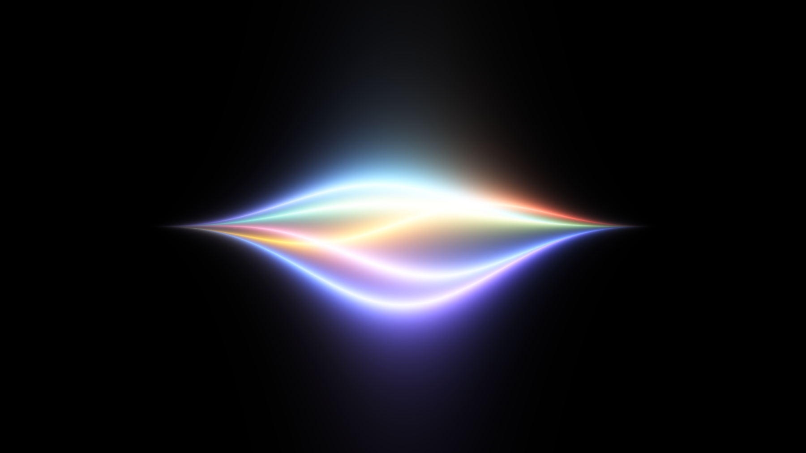
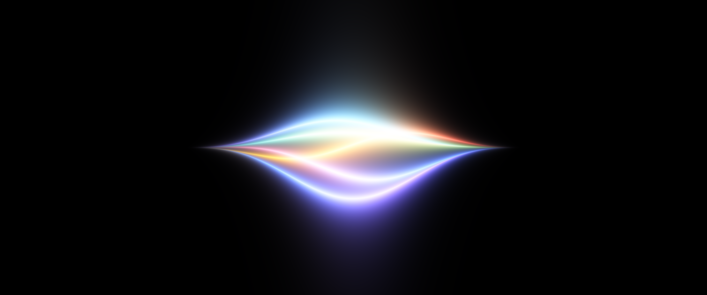
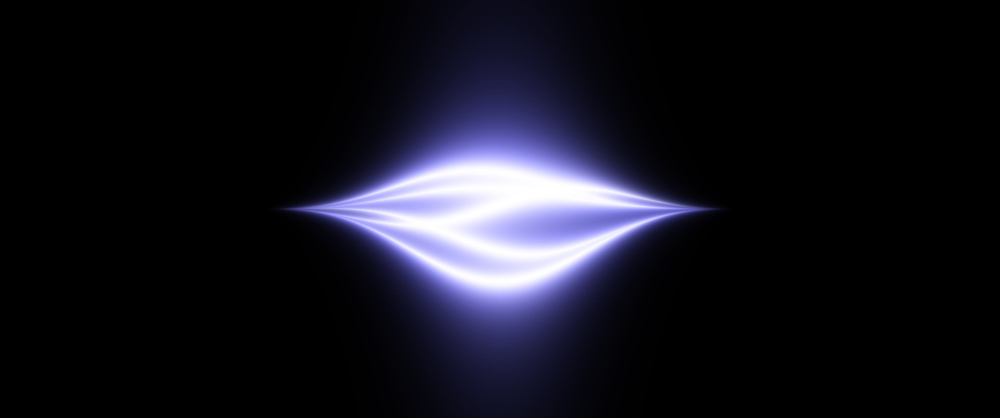

# Zavu

> One API. Every message.



A dark Omarchy theme derived from **Zavu Brand System V1.1**. Communication
infrastructure designed with scientific precision and editorial minimalism —
applied to a desktop.

Forked from [Last Horizon](https://github.com/HANCORE-linux/omarchy-lasthorizon-theme)
(MIT), fully recolored and re-geometried.

## What is Omarchy?

[Omarchy](https://omarchy.org) is an opinionated Arch Linux desktop built
around the [Hyprland](https://hypr.land) tiling compositor, by DHH
([basecamp/omarchy](https://github.com/basecamp/omarchy)). It ships a curated
set of tools — a Quickshell status bar, a launcher, notifications, a lock
screen, terminal, editor, browser — and wires them together so that a single
command restyles all of them at once.

That command is `omarchy theme set`, and a *theme* is what it reads. A theme
is a directory of small config files: one `colors.toml` that defines the
palette, plus per-application files for anything that needs more than colors.
Applying a theme copies that directory into place, generates the configs that
aren't shipped by hand, and reloads every running app. Nothing here is a
patch or an override — it is the whole look of the machine, versioned as text.

**You need Omarchy for this repository to be useful.** On any other Linux
setup the files are still readable as a color reference, but there is nothing
to apply them with.

## Install

```bash
omarchy theme install https://github.com/zavudev/omarchy-theme.git
omarchy theme set Zavu
```

## Palette

| Token | Hex | Name | Role |
|---|---|---|---|
| `background` | `#000000` | Void Black | System substrate |
| `foreground` | `#FFFFFF` | Pure White | Primary type |
| surface | `#18181B` | Surface | Popups, menus, cards |
| elevated | `#27272A` | Surface Elevated | Hairline borders, hover |
| `muted` | `#A1A1AA` | Muted Gray | Metadata, secondary text |
| `accent` | `#615FFF` | Signal Violet | Focus, selection, active state |

System colors (§5.3 — state only, never decoration):
`#4DF688` operational · `#FFDA5E` attention · `#FF5E5E` failure · `#6EFAFF` activity

## Design decisions

- **One accent, everywhere.** Violet appears on the focused window border, the
  selected row, and control focus. Nowhere else. The budget is ~3% of any
  composition (§5.5).
- **Editorial geometry.** Square corners, 1px borders, no shadows, no bloom.
  Technical-drawing precision, not a SaaS card.
- **Instrument motion.** A single curve — `cubic-bezier(0.22, 1, 0.36, 1)`,
  the brand's `ZAVU.motion.defaultEasing`. No overshoot, no spring physics;
  the brand system forbids both outright (§8.3, §12).
- **Six hues in the terminal.** The brand defines four system colors plus the
  accent, and syntax highlighting needs them separable. Orange (`#FF9C5E`) is
  a 50% mix of `warning` and `error` — the one derived value, and still inside
  the family. Nothing here is off-palette.

## Wallpapers

The first two are the **Strands** WebGL shader that runs in the hero of
`zavu.dev`. `tools/strands.c` is a literal CPU port of its fragment shader,
evaluated in the hero's resting state (no pulse, no fan, no pointer, no active
strand) with the uniforms the site passes it:
`count=5 · scale=1.5 · amplitude=1.05 · glow=2.6 · speed=0.18`.

| | |
|---|---|
|  |  |
| `01-strands.png` — the hero's channel palette (`#06B6D4 #EAB308 #FF4242 #1877F2 #7C3AED`). What the website shows. | `02-strands-signal.png` — same geometry, a single accent in the Signal Violet family. Keeps the one-accent rule (§5.5). |

Plus `03-void.png` — pure black. The void as substrate.

### Any resolution

The shader depends on aspect ratio, not just scale: `uv` is normalized by
height and the `env` envelope is measured across `uv.x`, so stretching a 16:9
render to 21:9 is not the same image as rendering it at 21:9. Render per
resolution instead of scaling:

```bash
tools/render 3440 1440                    # channel palette
tools/render 2560 1600 signal             # brand palette
tools/render 3840 2160 channels out.png
```

The repository ships 3440×1440. `tools/render` compiles the shader on first
use (needs `gcc` and ImageMagick) and takes about 100 ms per frame, so
generating a set for every display you own is cheap.

## What's in here

| File | Drives |
|---|---|
| `colors.toml` | The palette. Omarchy generates the terminal, editor, and browser configs from this alone. |
| `shell.toml` | Bar, menus, notifications, launcher, lock screen, polkit |
| `hyprland.lua` / `.conf` | Borders, gaps, corners, shadows, animation curves |
| `hyprlock.conf` | Lock screen input field |
| `btop.theme`, `cava_theme` | Terminal monitors |
| `walker.css`, `swayosd.css`, `gtk.css`, `mako.ini` | Launcher, OSD, GTK apps, fallback notifications |
| `neovim.lua`, `vencord.theme.css` | Editor, Discord |
| `tools/` | The Strands wallpaper renderer |

## License

MIT, inherited from the base theme — see [LICENSE](LICENSE).

The Zavu brand identity (logo, isotype, wordmark, and name) is **not** covered
by that license and remains the property of Zavu.
